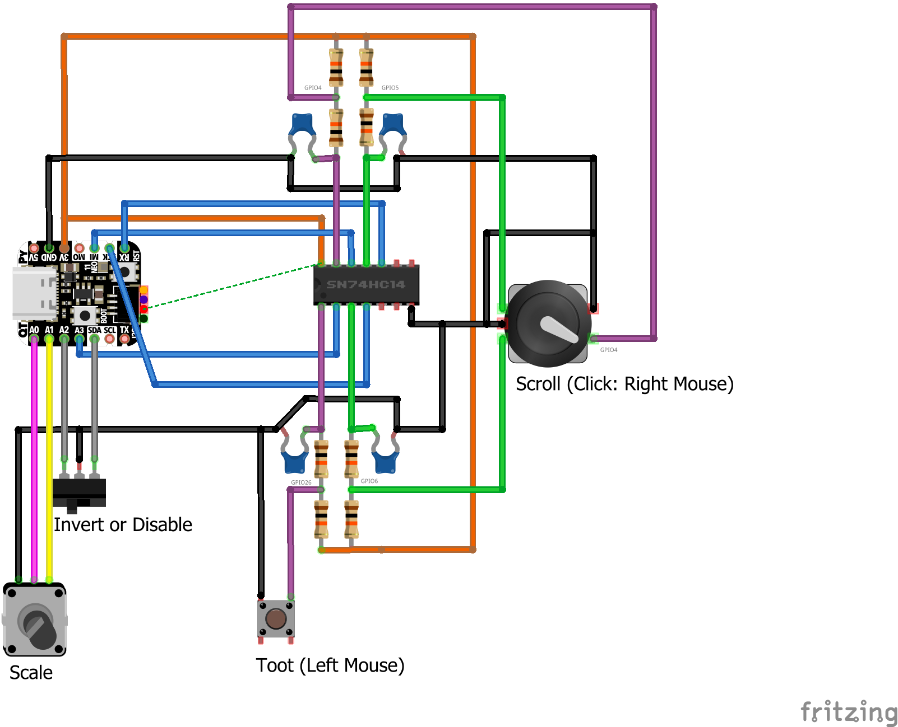
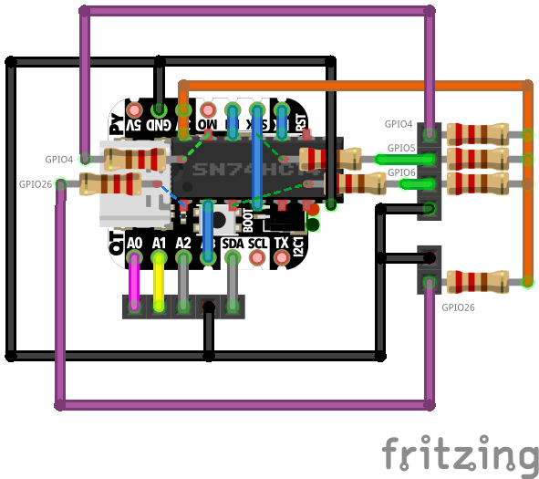

# Controller for trombone champ game

Control Trombone Champ by emulating a mouse with a QT-PY 2040 and VL53L0X distance sensor. This project was inspired by the [Adafruit Trombone Champ controller](https://learn.adafruit.com/circuitpython-trombone-champ-controller) by Liz Clark.

 This is a pared-down version of one I made [based on the Trinket m0](https://github.com/dwesely/trombone_champ_trinket).

## Operation

### Select precision
The 3-way switch specifies the precision when the device is plugged in. If the switch is in the middle position, the timing budget is set to 30ms. If the switch is set to one of the other positions, the timing budget will be set according to the table below. Blinks indicate which position was read.

The setting is only read once. To adjust the setting, unplug the device and plug it back in.

| Switch position | Timing Budget | Visual Indicator |
| ------------- | ------------- | ------------- |
| Left  | 20ms  | 2 blinks |
| Middle  | 30ms  | 3 blinks |
| Right  | 40ms  | 4 blinks |

### Select mode

3-way switch allows orientation to be inverted, or to disable the mouse emulation (so it doesn't interfere with operation outside the game).

When the switch is in the middle, no movement reports will be sent, and the scroll wheel (rotary encoder) will be operational.

When the switch is on one side, the distance measured by the device will be translated to the mouse position on the screen (farther distance = higher mouse).
When the switch is on the opposite side, the distance will be inverted (farther distance = lower mouse).

### Toot

The momentary switch clicks the left mouse button, activating toot.

### Navigation

Between songs, set to the 3-way switch to the middle to deactivate the vertical mouse, and to activate the scroll wheel. A rotary encoder acts as mouse wheel and the right mouse button. Scrolling the rotary encoder will scroll through available songs.

Hit the "Enter" key on the keyboard to select a song.

### Scaling Factor

You can adjust the potentiometer to set a scaling factor, to make the maximum detected distance higher or lower. This is used to make operation more comfortable for people with different sizes of arms.

## Other features 

Hardware debounce using a schmitt trigger to clean up "toot" command signal without adding processing complexity.

On board RGB LED indicates which which timing budget is selected, so the measurement precision can be changed without recoding.

JST connectors for input devices. 

### Libraries used
* adafruit_vl53l0x
* adafruit_bus_device
* neopixel
* [mouse_abs](https://gist.github.com/bitboy85/cdcd0e7e04082db414b5f1d23ab09005)

### Parts list
* QT PY RP2040 (Digikey: 1528-4900-ND)
* Adafruit VL53L0X Time of Flight Distance Sensor (Digikey: 1528-1814-ND)
* SN74AHC14N Schmitt Trigger (Digikey: 296-4550-5-ND)
* ANT13SECQE 3-way switch SPDT, ON-OFF-ON (Digikey: 2449-ANT13SECQE-ND)
* Momentary switch
* Rotary encoder
* 10k ohm linear rotary potentiometer
* (x8) 10k ohm 1/4 W resistor 
* (x4) 100nF ceramic capacitor
* JST connector sets (x1 2-pin, x1 4-pin, x1 5-pin)
* Generic toy foam dart gun as a project case (dollartree.com: SKU 323010)

### Connections

## Lessons learned
* Rotary encoder pins must be sequential on the QT PY: https://github.com/adafruit/circuitpython/issues/5334
* The toy gun worked very well as a case, there was fairly little modification
* The mouse_abs library tended to scroll endlessly until I added "self.report[5] = 0" to the report functions.

The following image is a Fritzing representation of the collapsed circuit. Using 7-pin female headers, the QT PY was raised above the Schmitt Trigger, which was mounted using a 14-pin DIP socket. The ceramic capacitors are not shown in this representation, but they fit beneath the Schmitt Trigger, inside the DIP socket. This is probably a terrible way to do it, but it worked enough for me, and it looked cool in the foam dart gun case.

